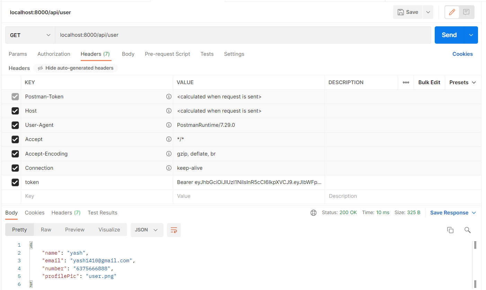

<div align="center">

# Login Api
# Node-Js Rest Full Api

#
</div>

## Features

> Login :  localhost:8000/api/login  "POST"

> Register : localhost:8000/api/register  "POST"

> Authenticate User Using JWT token

> get All Users info : localhost:8000/api/getallusers "GET"

> get Own info : localhost:8000/api/user "GET"

> edit own details : localhost:8000/api/editdetails "PUT"

> change password : localhost:8000/api/changepassword "PUT"


### Name of All Variables that are passed in body
> name, email, password, profilePic, number, token, currentpassword, confirmpassword


## Run Locally

### 1. Clone repo

```
$ git clone 
$ cd ecommerce
```
### 2. Setup & start project

```
$ npm install
$ npm start
```
## Project ScreenShot's
### Login 
<p align="center"></p>

### Registration 

<p align="center"></p>

### Edit User Details

<p align="center"></p>

### Change Password

<p align="center"></p>

### Get all users info

<p align="center"></p>

### Get user info

<p align="center"></p>


